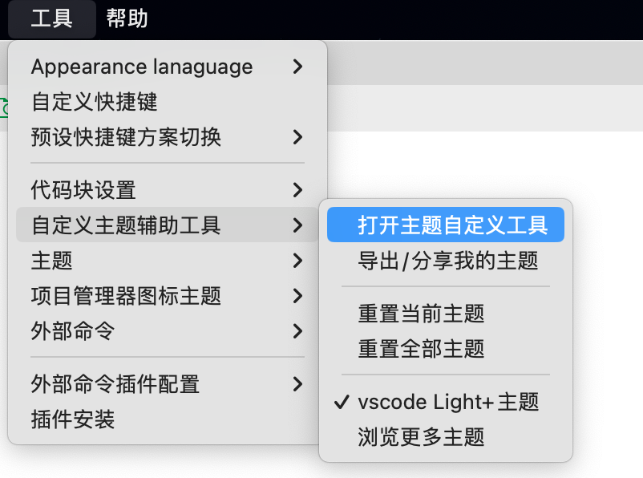
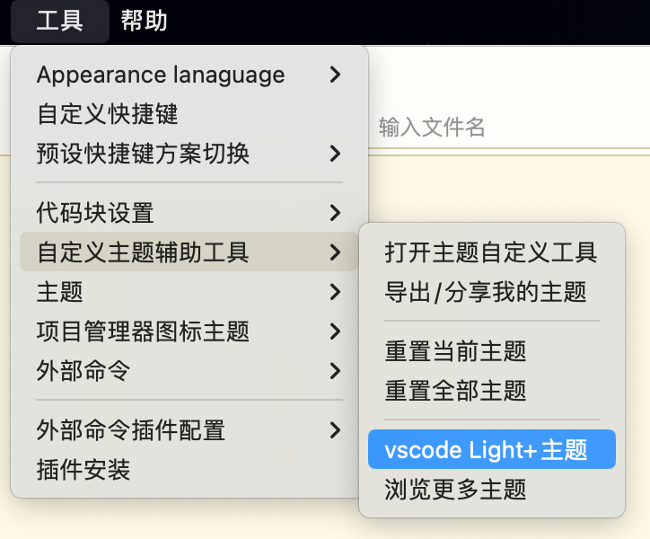
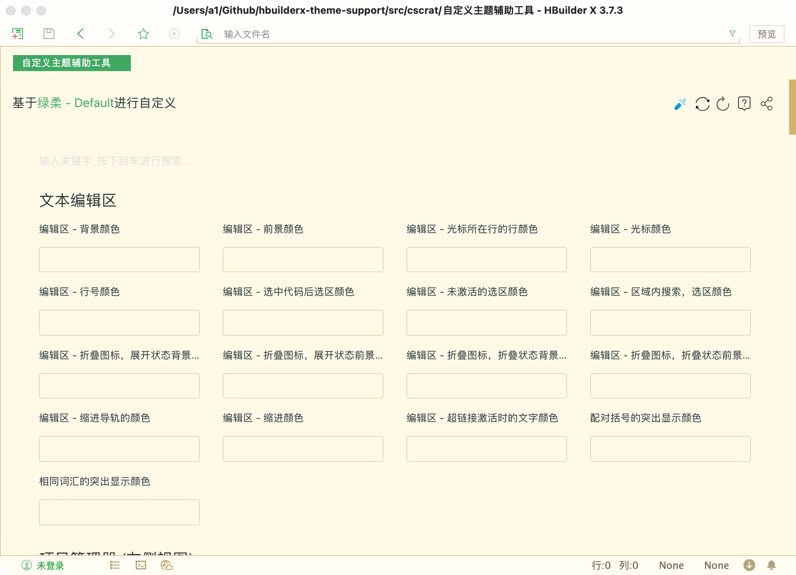

# HBuilderX自定义主题辅助工具

hbuilderx-theme-support插件, 是基于HBuilderX API开发的可视化主题定制插件。

一款适合自己的代码主题配色非常有必要，有助于保护眼睛、愉悦心情。

插件安装地址: [HBuilderX自定义主题辅助工具](https://ext.dcloud.net.cn/plugin?id=2684)

## 插件启动

## 安装内置主题

此插件内置了【vscode Light+】主题，点击菜单【工具 - 自定义主题辅助工具】，就可以安装【vscode Light+】主题。

## 插件使用

点击菜单【工具 - 自定义主题辅助工具 - 打开主题自定义工具】，即可自行设计主题。

## 特别注意

自定义主题，需要读写`HBuilderX配置文件`，请勿在预览过程中，强制关闭编辑器。否则，有可能造成配置文件损坏（配置文件损坏可能会导致HBuilderX编辑器无法启动）。